<!-- DRAGON CODE Z V3 // OFFICIAL MEDIA CUT // Profile README for @deanyadid09-cmyk -->

  <a href="https://github.com/deanyadid09-cmyk?tab=repositories">
    
  </a>

  
  

  

  
  
  

  <a href="https://github.com/deanyadid09-cmyk/dealengine">
    
  </a>
  

  
  
  

  
  

  
  
  <a href="https://github.com/deanyadid09-cmyk">
    
  </a>

<!--
  DRAGON CODE Z V3 // OFFICIAL MEDIA CUT
  Edit PROFILE in _src/build.py, then run: python _src/build.py
  Custom UI/HUD panels are local SVGs. Canon Dragon Ball media is referenced from official
  BANDAI NAMCO GIPHY and Dragon Ball Official Site sources listed in ASSET_SOURCES.md.
  This is a non-commercial fan profile. Dragon Ball media/characters belong to their respective rights holders.
  The activity panel intentionally does NOT expose private repository telemetry.
-->
